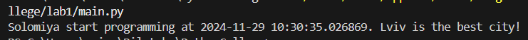
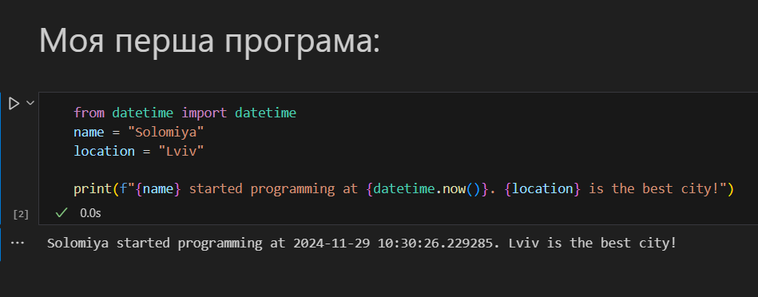

# Звіт до роботи 1
## Тема: оформлення робіт та перша програма
### Мета роботи: налаштувати середовище, створити репозиторій, попрацювати з Markdown та оформити звіт.

---
## Виконання роботи
* ### Результати виконання завдань:
    1. Створила репозиторій та оформила його.
    1. Навчилася працювати з репозиторієм, налаштувала інтеграцію з Visual Studio Code для комітів і пушів;
    1. Написала [першу програму Python та запустила її](./main.py):
    

    1. Написала [другу програму Python та запустила її](./main.ipynb):
    

---

## Висновок:

- Отже, у цій роботі я створила та оформила репозиторій. Також ознайомилася із форматуваннями Markdown. 
- Було досягнуто мету роботи: налаштувати середовище, створити репозиторій, попрацювати з Markdown та оформити звіт.
- Отримано нові знання: як працювати з Github, форматуванням Markdown та як створювати та зручно оформлювати репозиторій. 

---
⠀⠀⠀⠀