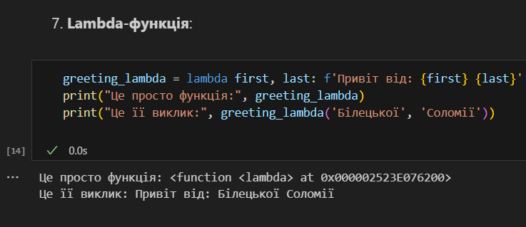

# Звіт до роботи 2
## Тема: Основи програмування на Python  
### Мета роботи: Ознайомитися з основними конструкціями та можливостями Python.

---

## Виконання роботи

* ### Результати виконання завдань:
    1. Створила [файл із базовими прикладами Python-коду](./main.ipynb) для ознайомлення з основними типами даних та основними конструкціями;
    1. Ознайомилася з циклами `for` і `while`, та навчилася використовувати конструкції `if` та `try-except`;
    1. Використала контекст-менеджер `with` для роботи з файлами;
    1. Створила Lambda-функцію та протестувала її виконання. Результат на скріні:
    

---

## Висновок:

- У цій роботі були виконані базові вправи для ознайомлення з конструкціями мови Python.
- Було досягнуто мету роботи: ознайомитися з основами Python та отримати практичний досвід роботи з базовими типами даних, циклами, розгалуженнями, обробкою помилок та контекст-менеджерами.
- Отримано знання про різні функції, наприклад, як використовувати lambda-функції та обробляти помилки.

---